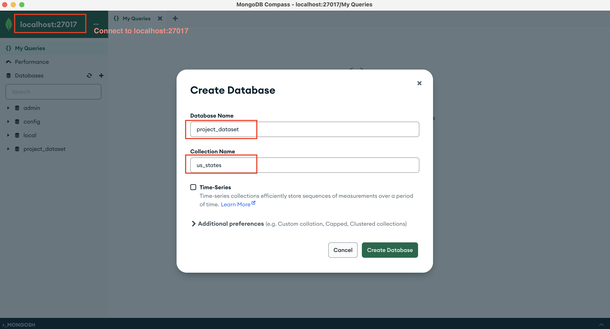
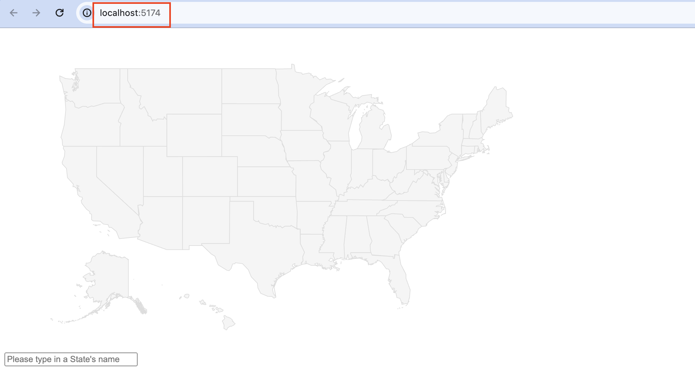
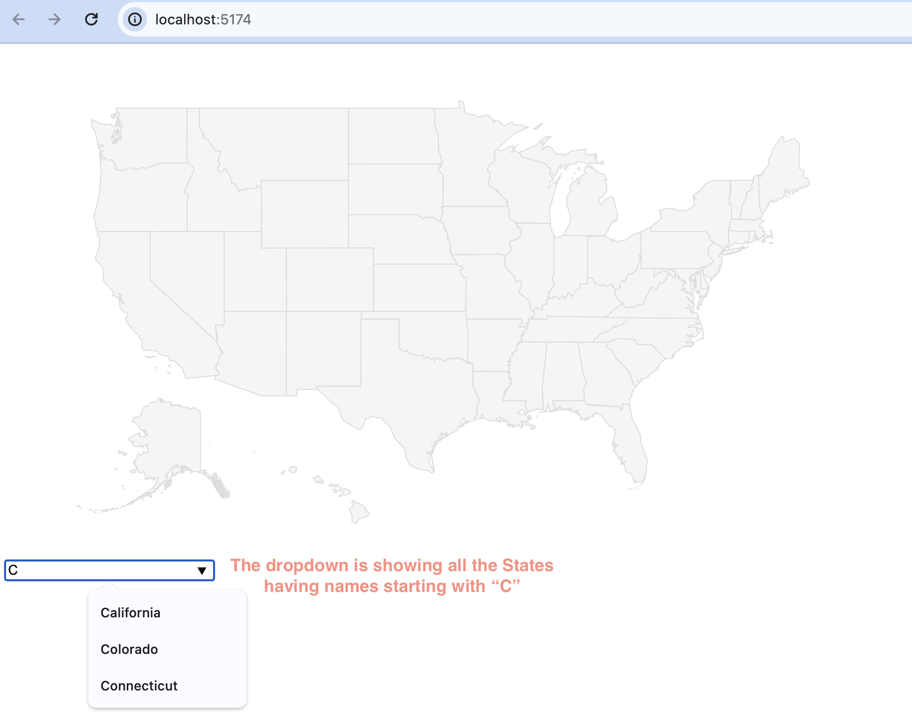
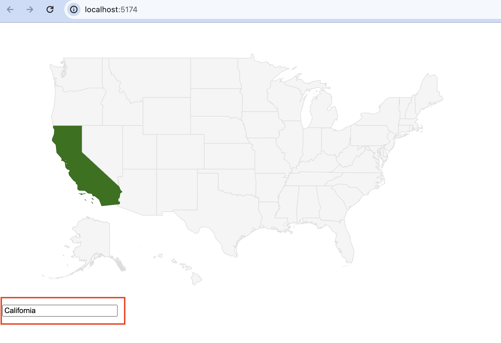

# GoogleMapHighlightState

- [GoogleMapHighlightState](#googlemaphighlightstate)
  - [About](#about)
  - [Setup](#setup)
  - [Starting the app](#starting-the-app)
  - [Usage](#usage)


## About

This is full stack project that builds an webapp for the user to search a State's name and highlights it on the map.

Frontend of this projects uses Vue.js + Google Map API. Backend of this project uses Go + Docker + MongoDB.

Since the project didn't use any of Google Map API's charging services, an API key isn't needed.


## Setup

**Docker image**

> https://www.mongodb.com/docs/manual/tutorial/install-mongodb-community-with-docker/

Based on the above instruction, run the following commands to setup the docker container.

```sh
docker pull mongodb/mongodb-community-server:latest
docker run --name mongodb -p 27017:27017 -d mongodb/mongodb-community-server:latest
```

**MongoDB tools**

> https://www.mongodb.com/try/download/compass

Download the MongoDB Compass (GUI) from the above link. It will be used for 

* connecting to the MongoDB inside the docker container
* importing the csv file (used for the below step)
* inspecting data inside the database


**Dataset**

> https://github.com/jakevdp/data-USstates/blob/master/state-abbrevs.csv

This is the csv file to import into MangoDB. In side MongoDB Compass (GUI),
* Connect to `localhost:27017`
* Create the database using the following names (see the below image)
  * Database Name: `project_dataset`
  * Collection Name: `us_states`
* Download and import the above dataset into this newly created database collection



**Frontend**

> NOTE: Nodejs is required for running the frontend. If it is not installed already, please download it from https://nodejs.org/en

Use the following commands to install the npm package dependencies

```sh
cd mini_project_frontend
npm install
```

**Backend**

> NOTE: Go is required for running the backend. If it is not installed yet, please download it from https://go.dev/doc/install

Use the following command to install the go package dependencies

```sh
cd mini_project_backend
go build
```

## Starting the app

**Starting the frontend**

```sh
cd mini_project_frontend
npm run dev
```

**Starting the backend**

```sh
cd mini_project_frontend
go run main.go
```

## Usage

After following the above instructions to setup and starting both the frontend and backend for the webapp, visit [localhost:5174](http://localhost:5174/) in your browser, and you will see the following image.



While you are typing in the State's name, you will see a dropdown showing all the States having names starting with prefix in the input box.



Users can either select the State's name or keep typing in more characters. When there's only one possible State left, the map will highlight the State. For example,
* When the user selects the option prompts inside the dropdown.
* When the user types in "Calif", since there are no other States starting with "Calif" besides California, the map will be refreshed and California will be highlighted in green on the map.




